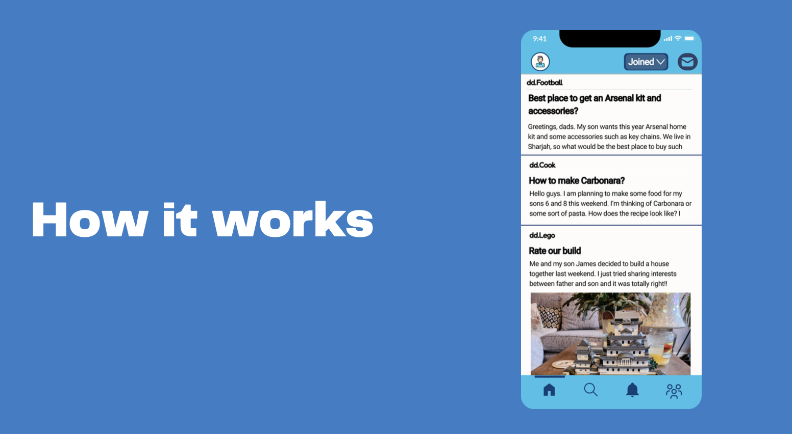

# Dad's Corner

**3rd Place – ADYC Hackathon**  
*(Abu Dhabi Youth Challenge × Techstars Startup Weekend)*

> Empowering fathers to be more present and engaged in their children's early development through community, knowledge, and shared experiences.

[](https://opensource.org/licenses/MIT)
[](https://github.com/ctg7987/adyc-early-childhood-innovation)

---

## Team Members

**Mohammed AlShemeili** • **Calvin Gutsa** • **Minn Thit Kyaw** • **Nigel Noronha** • **Mahwan Nanto**

**Hosted by:** Abu Dhabi Early Childhood Authority (ECA) & Techstars

---

## Overview

**Dad's Corner** is a mobile platform designed to connect fathers with their children through shared interests, community activities, and curated knowledge resources. Built during the **54-hour Techstars Startup Weekend** as part of the **Abu Dhabi Youth Challenge (ADYC)**, our solution addresses the critical gap in father engagement during early childhood development.

Our team secured **3rd place** among 15+ competing teams by demonstrating:

- **Clear problem–solution alignment** – Strong understanding of barriers preventing father engagement
- **User-centered reasoning** – Human-centered design focused on practical, actionable tools for busy dads
- **Scalability potential** – Platform architecture designed for community growth
- **Effective pitch execution** – Compelling narrative backed by rapid prototyping

### The Challenge

Fathers want to be more involved in their children's lives but face unique challenges:
- Limited time due to work commitments
- Uncertainty about age-appropriate activities
- Lack of father-focused communities and resources
- Traditional parenting resources primarily target mothers

### Our Approach

We employed **human-centered design principles**, **accessibility-first thinking**, and **rapid prototyping methodologies** to validate our concept and build a functional prototype within the intensive 3-day sprint.

---

## Problem Space

### Meet Ahmed

Ahmed is a working father who loves his kids but struggles to find quality time with them. Between work, household responsibilities, and daily routines, meaningful father-child moments are rare. He wants to be more present but doesn't know where to start.

### Key Challenges Fathers Face:

1. **Time Scarcity & Work-Life Balance**  
   Fathers juggle demanding careers with family responsibilities, making it difficult to carve out dedicated bonding time with their children.

2. **Lack of Father-Specific Resources**  
   Most parenting platforms and communities are designed for mothers, leaving fathers without tailored support, guidance, or relatable role models.

3. **Uncertainty About Age-Appropriate Activities**  
   Dads want to engage but often don't know what activities are suitable for their child's developmental stage or how to make everyday moments more meaningful.

4. **Isolation & Limited Peer Support**  
   Unlike mothers who have established networks and communities, fathers lack accessible platforms to connect with other dads, share experiences, and learn from each other.

These challenges create a critical need for a **father-focused platform** that makes engagement practical, accessible, and community-driven.

---

## Our Solution: Dad's Corner

**Dad's Corner** is a mobile platform that helps fathers connect with their children through three core pillars:

### 1. Discover Mutual Interests

Connect with your child through shared hobbies and interests. Our platform helps you identify common ground and suggests activities both you and your child will enjoy.


*Find dads in your community who share your interests and parenting journey.*

### 2. Knowledge Hub

Access curated content designed specifically for fathers:
- **Reading Resources** – Book recommendations, parenting guides, and child development insights
- **Listening Library** – Podcasts, audiobooks, and expert interviews you can consume during commutes
- **Quick Tips** – Practical, actionable advice for everyday parenting moments


*Browse our curated library of father-focused content, from parenting books to podcasts.*

### 3. Events & Activities

**How It Works:**

Discover and join local events, workshops, and activities designed for father-child bonding:
- Age-appropriate activity suggestions
- Community events and meetups
- Weekend adventure ideas
- Educational workshops



*Browse upcoming events, activities, and opportunities to connect with other dads and their kids.*

### Core Features:

**Personalized Recommendations**  
AI-driven suggestions based on your child's age, interests, and your availability.

**Community Network**  
Connect with other fathers in your area who share similar interests and parenting stages.

**Time-Efficient Design**  
Quick 5-minute activities for busy schedules alongside weekend adventure ideas.

**Evidence-Based Content**  
All resources and activities are grounded in child development research and best practices.

Our approach balances **practical usability** with **meaningful engagement**, ensuring fathers can easily integrate quality time into their busy lives.

---

## Why This Matters

### The Impact of Father Engagement

Research consistently shows that engaged fathers contribute significantly to children's:
- **Cognitive Development** - Better academic performance and problem-solving skills
- **Emotional Intelligence** - Improved social skills and emotional regulation
- **Self-Esteem** - Stronger confidence and resilience
- **Behavioral Outcomes** - Reduced behavioral problems and better adaptability

### The Gap We're Addressing

While 90% of fathers want to be more involved, only 40% feel they have adequate support and resources. Dad's Corner bridges this gap by:

- **Making it Easy** - Removing barriers to engagement with time-efficient, actionable suggestions
- **Building Community** - Connecting fathers who can learn from and support each other
- **Providing Confidence** - Offering evidence-based guidance tailored to fathers' unique perspectives
- **Creating Habits** - Helping fathers establish consistent, meaningful routines with their children

---

## Features

### What We Built in <54 Hours:

- **Rapid Prototyping** – Functional prototype demonstrating core user flows and value propositions
- **Evidence-Based Design** – Research-backed approach grounded in child development science
- **Scalable Architecture** – Technical foundation designed for future growth and feature expansion
- **Clear Roadmap** – Defined pathway for post-hackathon development and market validation
- **User-Centric UX** – Intuitive interface tested with potential users during the sprint
- **Accessibility Focus** – Designed with inclusivity and diverse user needs in mind

---

## Demo & Assets

| Asset Type | Status | Location |
|------------|--------|----------|
| **Pitch Deck** | Available | [`pitch-deck/DadsCorner.pdf`](./pitch-deck/DadsCorner.pdf) |
| **UI Screenshots** | Available | [`prototype/screenshots/`](./prototype/screenshots/) |
| **Wireframes** | Directory ready | [`prototype/wireframes/`](./prototype/wireframes/) |
| **Research Notes** | Documentation | [`research/`](./research/) |
| **Team Info** | Available | [`team/roles.md`](./team/roles.md) |

### Key Screenshots:

- **[Connect with Dads](./prototype/screenshots/slide-04-connect.png)** - Community discovery interface
- **[Reading & Listening](./prototype/screenshots/slide-05-reading-listening.png)** - Knowledge hub resources
- **[How It Works](./prototype/screenshots/slide-06-how-it-works.png)** - Activity feed and event discovery

> **Note:** This project was built during a 54-hour hackathon. Some features shown are conceptual prototypes.

---

## Hackathon Context

### About ADYC × Techstars Startup Weekend

The **Abu Dhabi Youth Challenge (ADYC)** in partnership with **Techstars** brought together aspiring entrepreneurs, designers, and developers for an intensive **54-hour startup sprint** focused on early childhood development innovation.

#### Event Highlights:

- **Focus Area:** Real-world challenges in early childhood development & wellbeing
- **Duration:** 3-day intensive innovation sprint (Friday evening → Sunday evening)
- **Host:** Abu Dhabi Early Childhood Authority (ECA)
- **Network:** Techstars global accelerator ecosystem
- **Methodology:** Human-centered design, lean startup, rapid prototyping

#### Hackathon Themes Covered:

- Child development & wellbeing
- Parenting support & education
- EdTech for early learners
- Community-building tools
- Safety & child protection
- Accessibility & inclusion

#### Mentorship & Support:

Participants received guidance from an impressive roster of mentors, including:

- **Startup Founders** – Serial entrepreneurs with exits and scaling experience
- **Venture Capitalists** – Investors active in EdTech and social impact
- **Product Managers** – Leaders from tech companies and startups
- **Innovation Experts** – Specialists in human-centered design and rapid prototyping

#### Impact & Outcomes:

Winners gained access to:

- Continued mentorship from industry leaders
- Potential incubation opportunities through ECA innovation programs
- Visibility within the UAE's startup and early childhood development ecosystem
- Networking with investors, government partners, and education stakeholders

---

## Understanding the Ecosystem

### Abu Dhabi Early Childhood Authority (ECA)

The **ECA** is a government entity dedicated to advancing early childhood development across Abu Dhabi. Their mission includes:

- Establishing world-class standards for early childhood education
- Ensuring holistic child development (physical, cognitive, emotional, social)
- Supporting families with evidence-based parenting resources
- Building partnerships between government, private sector, and communities
- Driving innovation through research and technology adoption

The ECA recognizes that **the first five years** of a child's life are critical for brain development and long-term outcomes, making early intervention and support crucial for individual and societal success.

### Techstars Startup Weekend

**Techstars Startup Weekend** is the world's leading experiential entrepreneurship education program, operating in 150+ countries. The format includes:

- **Friday:** Pitching ideas, forming teams, validating concepts
- **Saturday:** Building prototypes, conducting customer discovery, iterating
- **Sunday:** Finalizing presentations, pitching to judges, celebrating

The program teaches participants to:

- Move from idea to execution rapidly
- Validate assumptions through real user feedback
- Build minimum viable products (MVPs)
- Pitch effectively to investors and stakeholders

Alumni of Techstars programs have founded companies that raised over **$30 billion** in funding, demonstrating the power of the methodology and network.

---

## Team Roles

Our diverse team of 5 members brought complementary skills to tackle the challenge:

| Team Member | Primary Role | Key Contributions |
|-------------|--------------|-------------------|
| **Mohammed AlShemeili** | Hustler (Business/Marketing) | Market research & competitive analysis, Business model development, Go-to-market strategy |
| **Calvin Gutsa** | Hacker (Technical/Product) | Prototype development, Technical architecture, Feature implementation |
| **Minn Thit Kyaw** | Hipster (Design/UX) | User experience design, Wireframes and mockups, Visual design and branding |
| **Nigel Noronha** | Hustler (Business/Ideas) | Customer discovery and validation, Pitch deck creation, Presentation delivery |
| **Mahwan Nanto** | Domain Expert | Subject matter expertise (early childhood development), Research validation, Content development |

> **Note:** Detailed role descriptions and individual contributions are available in [`team/roles.md`](./team/roles.md).

---

## Research & Documentation

Explore our research process and findings:

- **[Problem Space Analysis](./research/problem-space.md)** – Deep dive into challenges facing early childhood development
- **[Customer Discovery Notes](./research/customer-discovery-notes.md)** – Insights from user interviews and validation
- **[Competitor Analysis](./research/competitor-analysis.md)** – Landscape review of existing solutions

---

## Next Steps & Future Enhancements

This repository serves as a starting point. Future improvements could include:

### Priority Additions:

- [ ] Upload original pitch deck and presentation materials
- [ ] Add prototype demo video or live link
- [ ] Include wireframes and user journey maps
- [ ] Expand research documentation with data and findings
- [ ] Document technical architecture and codebase (if applicable)
- [ ] Add user testing results and feedback
- [ ] Create detailed product roadmap
- [ ] Include financial projections and business model canvas

### Long-Term Vision:

- [ ] Develop MVP beyond hackathon prototype
- [ ] Conduct extended user research and pilot programs
- [ ] Explore partnership opportunities with ECA and educational institutions
- [ ] Seek funding or incubation support
- [ ] Build out full technical implementation

---

## Contributing

We welcome contributions to help reconstruct and expand this project! If you were part of this hackathon or have relevant expertise:

1. **Fork this repository**
2. **Add missing assets** (pitch decks, screenshots, code, etc.)
3. **Expand documentation** with additional context or research
4. **Submit a pull request** with clear descriptions

Please maintain the professional structure and add detailed commit messages.

---

## License

This project is licensed under the **MIT License** – see the [LICENSE](./LICENSE) file for details.

```
MIT License

Copyright (c) 2024 ADYC Early Childhood Innovation Team

Permission is hereby granted, free of charge, to any person obtaining a copy
of this software and associated documentation files (the "Software"), to deal
in the Software without restriction, including without limitation the rights
to use, copy, modify, merge, publish, distribute, sublicense, and/or sell
copies of the Software, and to permit persons to whom the Software is
furnished to do so, subject to the following conditions:

The above copyright notice and this permission notice shall be included in all
copies or substantial portions of the Software.

THE SOFTWARE IS PROVIDED "AS IS", WITHOUT WARRANTY OF ANY KIND, EXPRESS OR
IMPLIED, INCLUDING BUT NOT LIMITED TO THE WARRANTIES OF MERCHANTABILITY,
FITNESS FOR A PARTICULAR PURPOSE AND NONINFRINGEMENT. IN NO EVENT SHALL THE
AUTHORS OR COPYRIGHT HOLDERS BE LIABLE FOR ANY CLAIM, DAMAGES OR OTHER
LIABILITY, WHETHER IN AN ACTION OF CONTRACT, TORT OR OTHERWISE, ARISING FROM,
OUT OF OR IN CONNECTION WITH THE SOFTWARE OR THE USE OR OTHER DEALINGS IN THE
SOFTWARE.
```

---

## Acknowledgments

- **Abu Dhabi Early Childhood Authority** – For hosting and supporting youth-driven innovation
- **Techstars** – For bringing world-class entrepreneurship education to Abu Dhabi
- **Our Mentors** – For invaluable guidance during the 54-hour sprint
- **Fellow Participants** – For creating an inspiring, collaborative environment
- **Judges** – For recognizing the potential of our solution

---

## Contact

For questions, collaboration opportunities, or to contribute missing assets:

- **Repository:** [github.com/ctg7987/adyc-early-childhood-innovation](https://github.com/ctg7987/adyc-early-childhood-innovation)
- **Issues:** Use GitHub Issues for questions or suggestions

---

<div align="center">

**Built during ADYC × Techstars Startup Weekend**

*Empowering early childhood development through innovation*

</div>
3rd-place winning project from the ADYC Hackathon (Abu Dhabi Youth Challenge x Techstars Startup Weekend). A 54-hour startup prototype focused on early childhood development, built with human-centered design, rapid prototyping, and behavioral insights.
